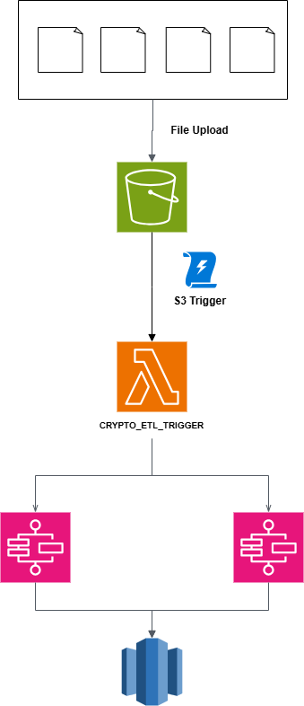
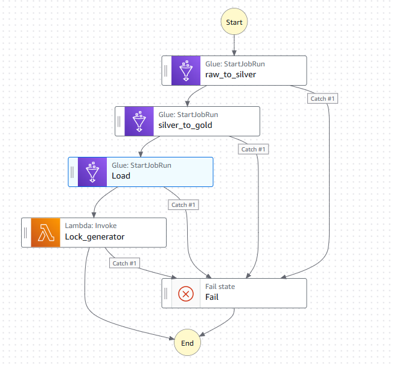

# Pipeline E2E AWS per l'analisi di Bitcoin e Monero
## Scopo del progetto

Lo scopo del progetto è quello di realizzare due pipeline di ETL per trattare dei dati relativi a due criptovalute, Bitcoin e Monero.

Per comprendere quali fossero le trasformazioni da realizzare sui dati, è stata realizzata una preliminare indagine esplorativa, i cui esiti sono contenuti nel file ```eda_analysis.ipynb```

### Architettura

La pipeline E2E è stata realizzata seguendo l'archiettura rappresentata nel seguente schema: 

Quando i file di input relativi ad una specifica criptovaluta sono salvati all'interno di un apposito bucket S3, viene attivato un trigger che attiva la seguente funzione lambda:

```crypto_etl_trigger```

Tale funzione lambda ha il compito di verificare che per ciascuna delle due criptovalute siano disponibili i due file di input.
Quando sono entrabi disponibili, essa richiama un'apposita Step function che realizza l'insieme dei processi di caricamento,trasformazione e salvataggio dei dati all'interno di un data warehouse AWS Redshift.

L'output del processo è rappresentato da una tabella finale per ciascuna criptovalta, sulle quali sono montate poi delle visualizzazioni realizzate tramite Amazon QuickSight.

#### ```crypto_etl_trigger``` lambda

Come già anticipato, il compito di tale funzione è quello di monitorare la presenza di entrambi i file di input per ciascuna delle criptovalute.
In particolare, tale monitoraggio consiste nell'analizzare la notifica di trigger S3 che arriva, verificando che per ciascuna delle due critpovalute siano presenti i due file di input.

Se la verifica è soddisfatta, si aggiunge un ulteriore passaggio di controllo, ovvero si verifica la presenza di un file di lock (BTC.lock o monero.lock) all'interno del bucket: esso viene utilizzato come file di controllo per gestire eventuali duplicazioni del processo di trasformazione dei file di input.
La struttura di tale file, infatti, prevede il contenuto di un solo timestamp, che indica il momento di fine esecuzione di una pipeline di trasformazione.
La funzione lambda confronta la data di ultima modifica dei file di input con il tempo contenuto nel lock file (ove presente): se i file non sono stati modificati dopo la data contenuta nel lock file, allora la pipeline non viene richiamata.

Tale controllo si rende necessario, in quanto il trigger S3 viene attivato ogni qual volta c'è l'inserimento di un singolo file all'interno della cartella dove sono contenuti i file di input e quindi tale metodologia consente di evitare che notifiche successive possano generare chiamate successive alle step function per file di input già processati.

#### Macchine a stati

Le macchine a stati definite per le due criptovalute, di fatto sono la stessa macchina duplicata e per le quali sono definite delle variabili differenti, a seconda della valuta da dover trattare.

Il processo di ETL gestito dalle Step Functions è rappresentato nel seguente schema:



La struttura del processo prevede le seguenti fasi:

- raw_to_silver
il primo stadio del processo che prevede la lettura dei dati dai file csv di input, il trattamento dei missing e una generica formattazione di tutti i dati in input al processo. I dati dei prezzi e del Google trend, dopo essere stati trattati, vengono salvati in delle tabelle sul Glue Data Catalog, per storicizzarli in caso di successive analisi di business. Gli output così ottenuti sono caricati poi anche in un file .parquet all'interno del bucket ```silver```.

- silver_to_gold
il secondo stadio del processo, che prevede l'estrazione dei dati contenuti nei file parquet presenti nel bucket ```silver```, l'eliminazione delle colonne superflue ai fini delle analisi sui prezzi, lo smussamento dei prezzi mediante la loro sostituzione con la media mobile a 10 giorni, ed un'operazione di join con i dati del Google Trend Index, per avere in un'unica tabella finale sia i prezzi che il valore del GTI. Tale tabella viene poi caricata in un file parquet nel bucket ```gold```.

- load
rappresenta l'ultimo step del processo di ETL, in cui si effettua un'operazione di COPY dal file parquet presente nel bucket ```gold``` all'interno di una tabella presente in un cluster serverless Redshift.

Alla fine del processo, quindi, si avranno a disposizione due tabelle finali su Redshift (una per ciascuna criptovaluta) sulle quali sono state montate delle rappresentazioni dell'andamento dei prezzi delle crypto, raffrontate al valore del Google Trend Index ad esse associato.